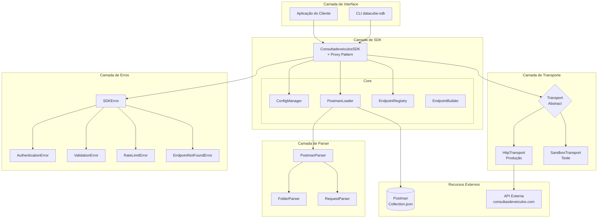
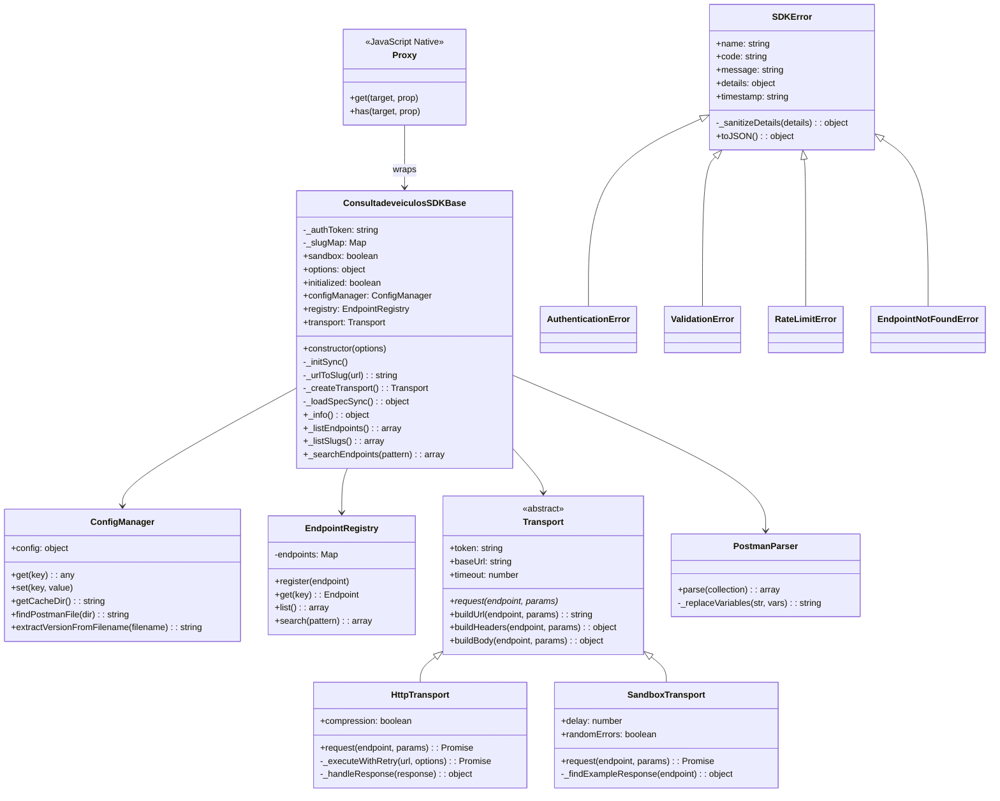
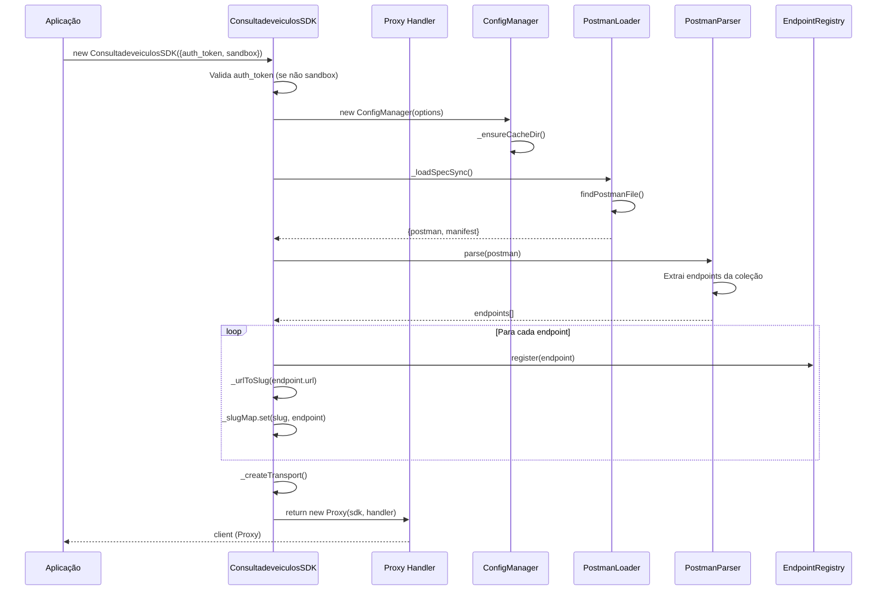
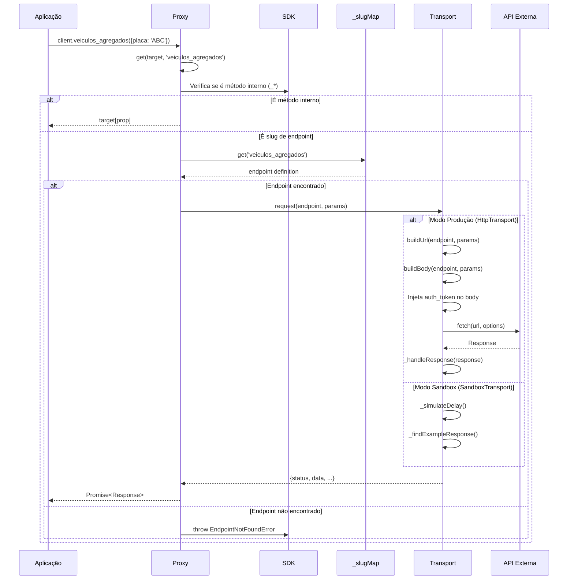

# 📚 Documentação Técnica - ConsultadeveiculosSDK

## Índice

1. [Visão Geral da Arquitetura](#1-visão-geral-da-arquitetura)
2. [Diagrama de Componentes](#2-diagrama-de-componentes)
3. [Diagrama de Classes](#3-diagrama-de-classes)
4. [Diagrama de Sequência](#4-diagrama-de-sequência)
5. [Design Patterns Utilizados](#5-design-patterns-utilizados)
6. [Fluxo de Dados](#6-fluxo-de-dados)
7. [Estrutura de Diretórios](#7-estrutura-de-diretórios)
8. [Detalhamento dos Módulos](#8-detalhamento-dos-módulos)

---

## 1. Visão Geral da Arquitetura

A SDK foi projetada como um **Runtime Engine** que consome endpoints de uma coleção Postman dinamicamente, sem necessidade de implementação manual de cada endpoint.

### Princípios Arquiteturais

```
┌─────────────────────────────────────────────────────────────────┐
│                         PRINCÍPIOS                              │
├─────────────────────────────────────────────────────────────────┤
│  • Zero Hardcode    → Nenhum endpoint é escrito manualmente     │
│  • Runtime Dynamic  → Métodos gerados em tempo de execução      │
│  • Spec-Driven      → Postman Collection é a fonte da verdade   │
│  • Security First   → Tokens nunca expostos em logs/erros       │
└─────────────────────────────────────────────────────────────────┘
```

---

## 2. Diagrama de Componentes



---

## 3. Diagrama de Classes



---

## 4. Diagrama de Sequência

### 4.1 Inicialização da SDK



### 4.2 Chamada de Endpoint



---

## 5. Design Patterns Utilizados

### 5.1 🎭 Proxy Pattern

**Onde:** `src/core/SDK.js`

**Por quê:** Permite interceptar todas as chamadas de método e roteá-las dinamicamente para os endpoints corretos, sem precisar declarar cada método manualmente.

```javascript
// src/core/SDK.js - Linha ~350

export function ConsultadeveiculosSDK(options = {}) {
    const sdk = new ConsultadeveiculosSDKBase(options);
    
    return new Proxy(sdk, {
        get(target, prop) {
            // 1. Propriedades internas (começam com _) - acesso direto
            if (typeof prop === 'string' && prop.startsWith('_')) {
                return typeof target[prop] === 'function' 
                    ? target[prop].bind(target) 
                    : target[prop];
            }
            
            // 2. Propriedades existentes no objeto
            if (prop in target) {
                return target[prop];
            }
            
            // 3. Busca no mapa de slugs (endpoints dinâmicos)
            if (target._slugMap.has(prop)) {
                const endpoint = target._slugMap.get(prop);
                // Retorna função que executa o endpoint
                return (params = {}) => target._executeEndpoint(endpoint, params);
            }
            
            // 4. Slug não encontrado - retorna função que lança erro
            return (params = {}) => {
                throw new EndpointNotFoundError(
                    `Endpoint "${prop}" não encontrado...`
                );
            };
        }
    });
}
```

**Benefícios:**
- Zero código hardcoded para endpoints
- Adicionar novo endpoint = apenas atualizar Postman
- Autocomplete não funciona, mas CLI lista todos os slugs

---

### 5.2 🏭 Factory Pattern

**Onde:** `_createTransport()` em `src/core/SDK.js`

**Por quê:** Permite criar diferentes tipos de transporte (HTTP real vs Sandbox) baseado na configuração, sem expor a lógica de criação.

```javascript
// src/core/SDK.js - Linha ~240

_createTransport() {
    const transportOptions = {
        token: this._authToken,
        baseUrl: this.options.baseUrl,
        timeout: this.configManager.get('timeout'),
        // ...
    };

    // Factory decide qual implementação usar
    if (this.sandbox) {
        return new SandboxTransport(transportOptions);
    }
    
    return new HttpTransport(transportOptions);
}
```

**Benefícios:**
- Troca de implementação sem alterar código cliente
- Testes facilitados com SandboxTransport
- Separação clara de responsabilidades

---

### 5.3 📋 Strategy Pattern

**Onde:** Classes `Transport`, `HttpTransport`, `SandboxTransport`

**Por quê:** Permite trocar a estratégia de transporte em runtime. O SDK não precisa saber se está usando HTTP real ou sandbox.

```javascript
// src/transport/Transport.js - Interface base

export class Transport {
    async request(endpoint, params = {}, options = {}) {
        throw new Error('Método request() deve ser implementado');
    }
    
    buildUrl(endpoint, params) { /* ... */ }
    buildHeaders(endpoint, params) { /* ... */ }
    buildBody(endpoint, params) { /* ... */ }
}
```

```javascript
// src/transport/HttpTransport.js - Estratégia de Produção

export class HttpTransport extends Transport {
    async request(endpoint, params = {}, options = {}) {
        const url = this.buildUrl(endpoint, params);
        const body = this.buildBody(endpoint, params);
        
        // Injeta token no body
        if (this.token && body) {
            body.auth_token = this.token;
        }
        
        return this._executeWithRetry(url, requestOptions);
    }
}
```

```javascript
// src/transport/SandboxTransport.js - Estratégia de Teste

export class SandboxTransport extends Transport {
    async request(endpoint, params = {}, options = {}) {
        await this._simulateDelay();
        
        // Retorna exemplo do Postman, não faz HTTP
        return {
            success: true,
            status: 200,
            data: this._findExampleResponse(endpoint),
            sandbox: true
        };
    }
}
```

**Benefícios:**
- Desenvolvimento offline com sandbox
- Testes não dependem de API externa
- Fácil adicionar novos transportes (ex: WebSocket)

---

### 5.4 🗃️ Registry Pattern

**Onde:** `src/core/EndpointRegistry.js`

**Por quê:** Centraliza o armazenamento e busca de endpoints, funcionando como um "dicionário" de todos os endpoints disponíveis.

```javascript
// src/core/EndpointRegistry.js

export class EndpointRegistry {
    constructor() {
        this.endpoints = new Map();
    }

    register(endpoint) {
        if (!endpoint.key) {
            throw new Error('Endpoint deve ter uma key');
        }
        this.endpoints.set(endpoint.key, endpoint);
    }

    get(key) {
        return this.endpoints.get(key);
    }

    list() {
        return Array.from(this.endpoints.values());
    }

    search(pattern) {
        const regex = new RegExp(pattern, 'i');
        return this.list().filter(ep => 
            regex.test(ep.key) || 
            regex.test(ep.name) || 
            regex.test(ep.url)
        );
    }
}
```

**Benefícios:**
- Busca O(1) por key
- Busca por padrão (regex)
- Listagem completa para CLI

---

### 5.5 🔨 Builder Pattern

**Onde:** `src/core/EndpointBuilder.js` e método `buildBody()` em Transport

**Por quê:** Constrói objetos complexos (requisições) passo a passo, separando a construção da representação.

```javascript
// src/transport/Transport.js

buildBody(endpoint, params = {}) {
    const body = params.body || params;
    
    // Remove propriedades especiais
    const { path, query, headers, ...bodyData } = body;
    
    // Merge com template do endpoint
    if (endpoint.body && typeof endpoint.body === 'object') {
        return { ...endpoint.body, ...bodyData };
    }

    return Object.keys(bodyData).length > 0 ? bodyData : null;
}

buildUrl(endpoint, params = {}) {
    let url = endpoint.url;
    
    // Substitui path parameters
    for (const [key, value] of Object.entries(params.path || {})) {
        url = url.replace(`{{${key}}}`, encodeURIComponent(value));
    }
    
    // Adiciona query parameters
    // ...
    
    return url;
}
```

**Benefícios:**
- Construção de requisição clara e testável
- Separação de URL, headers e body
- Fácil extensão para novos tipos de parâmetros

---

### 5.6 🎨 Template Method Pattern

**Onde:** Classe `Transport` com métodos abstratos implementados nas subclasses

**Por quê:** Define o esqueleto do algoritmo (request) na classe base, permitindo que subclasses sobrescrevam etapas específicas.

```javascript
// Transport define a estrutura
class Transport {
    buildUrl() { /* implementação comum */ }
    buildHeaders() { /* implementação comum */ }
    buildBody() { /* implementação comum */ }
    
    // Método abstrato - deve ser implementado
    async request() { throw new Error('Implementar'); }
}

// HttpTransport implementa o comportamento específico
class HttpTransport extends Transport {
    async request(endpoint, params) {
        // Usa métodos herdados
        const url = this.buildUrl(endpoint, params);
        const headers = this.buildHeaders(endpoint, params);
        const body = this.buildBody(endpoint, params);
        
        // Implementação específica
        return fetch(url, { headers, body });
    }
}
```

---

### 5.7 🛡️ Null Object Pattern

**Onde:** Tratamento de token em modo sandbox

**Por quê:** Evita verificações de null espalhadas pelo código.

```javascript
// Em vez de verificar null em todo lugar:
if (this.token) {
    body.auth_token = this.token;
}

// Sandbox simplesmente tem token = null
// e o transporte ignora naturalmente
this._authToken = this.sandbox ? null : auth_token;
```

---

## 6. Fluxo de Dados

```
┌──────────────────────────────────────────────────────────────────────────┐
│                           FLUXO DE DADOS                                 │
└──────────────────────────────────────────────────────────────────────────┘

     ENTRADA                    PROCESSAMENTO                      SAÍDA
  ┌───────────┐              ┌─────────────────┐              ┌───────────┐
  │ Postman   │──────────────│ PostmanParser   │──────────────│ Endpoints │
  │ JSON      │   Leitura    │ FolderParser    │  Extração    │ Registry  │
  │           │              │ RequestParser   │              │ + SlugMap │
  └───────────┘              └─────────────────┘              └───────────┘
                                                                    │
                                                                    ▼
  ┌───────────┐              ┌─────────────────┐              ┌───────────┐
  │ client.   │──────────────│ Proxy Handler   │──────────────│ Endpoint  │
  │ veiculos_ │   Chamada    │ Intercepta      │   Lookup     │ Definition│
  │ agregados │              │ Método          │              │           │
  └───────────┘              └─────────────────┘              └───────────┘
                                                                    │
                                                                    ▼
  ┌───────────┐              ┌─────────────────┐              ┌───────────┐
  │ Parâmetros│──────────────│ Transport       │──────────────│ Request   │
  │ {placa:   │   Build      │ buildUrl()      │  Construção  │ HTTP/     │
  │  'ABC'}   │              │ buildBody()     │              │ Sandbox   │
  └───────────┘              └─────────────────┘              └───────────┘
                                                                    │
                                                                    ▼
  ┌───────────┐              ┌─────────────────┐              ┌───────────┐
  │ API       │◄─────────────│ fetch() ou      │──────────────│ Response  │
  │ Externa   │   HTTP       │ Sandbox Mock    │   Retorno    │ {status,  │
  │           │              │                 │              │  data}    │
  └───────────┘              └─────────────────┘              └───────────┘
```

---

## 7. Estrutura de Diretórios

```
consultasdeveiculos-sdk-nodejs/
│
├── src/
│   │
│   ├── index.js                 # 📦 Entry point - Exporta SDK e erros
│   │
│   ├── core/                    # 🧠 NÚCLEO DA SDK
│   │   ├── SDK.js               #    ⭐ Classe principal + Proxy
│   │   ├── ConfigManager.js     #    ⚙️ Configurações e cache
│   │   ├── EndpointRegistry.js  #    📋 Registry de endpoints
│   │   ├── EndpointBuilder.js   #    🔨 Builder de endpoints
│   │   └── PostmanLoader.js     #    📂 Carregador de arquivos
│   │
│   ├── parser/                  # 📝 PARSERS DO POSTMAN
│   │   ├── PostmanParser.js     #    Parser principal
│   │   ├── FolderParser.js      #    Parser de pastas
│   │   └── RequestParser.js     #    Parser de requests
│   │
│   ├── transport/               # 🚀 CAMADA DE TRANSPORTE
│   │   ├── Transport.js         #    Interface abstrata
│   │   ├── HttpTransport.js     #    Implementação HTTP (produção)
│   │   └── SandboxTransport.js  #    Implementação Mock (testes)
│   │
│   ├── errors/                  # ⚠️ HIERARQUIA DE ERROS
│   │   ├── index.js             #    Exporta todos os erros
│   │   └── SDKError.js          #    Classes de erro
│   │
│   └── cli/                     # 💻 INTERFACE DE LINHA DE COMANDO
│       ├── index.js             #    Entry point CLI
│       ├── endpoints.js         #    Comando: listar endpoints
│       ├── version.js           #    Comando: versão
│       ├── doctor.js            #    Comando: diagnóstico
│       ├── update.js            #    Comando: atualizar spec
│       └── clear-cache.js       #    Comando: limpar cache
│
├── spec/                        # 📋 ESPECIFICAÇÃO DA API
│   ├── Consultas - V*.json      #    Coleção Postman (fonte da verdade)
│   └── manifest.json            #    Metadados de versão
│
├── examples/                    # 📚 EXEMPLOS DE USO
│   ├── basic-usage.js
│   ├── sandbox-mode.js
│   ├── error-handling.js
│   └── explore-endpoints.js
│
├── tests/                       # 🧪 TESTES
│   └── sdk.test.js
│
├── DOC.md                       # 📖 Esta documentação
├── SECURITY.md                  # 🔐 Política de segurança
├── README.md                    # 📄 Documentação de uso
├── package.json
└── .gitignore
```

---

## 8. Detalhamento dos Módulos

### 8.1 SDK.js - O Coração do Sistema

```javascript
/**
 * RESPONSABILIDADES:
 * 1. Validar credenciais
 * 2. Carregar e parsear Postman
 * 3. Criar mapa de slugs
 * 4. Criar transporte apropriado
 * 5. Interceptar chamadas via Proxy
 */

// Fluxo de inicialização
constructor(options) {
    // 1. Segurança: remove token das options
    const { auth_token, ...safeOptions } = options;
    
    // 2. Armazena token de forma não-enumerável
    Object.defineProperty(this, '_authToken', {
        value: this.sandbox ? null : auth_token,
        enumerable: false  // Não aparece em JSON.stringify
    });
    
    // 3. Validação
    if (!this.sandbox && !this._authToken) {
        throw new AuthenticationError('auth_token é obrigatório');
    }
    
    // 4. Inicialização síncrona
    this._initSync();
}

// Conversão URL → Slug
_urlToSlug(url) {
    // https://api.com/veiculos/debitos-sp
    //                 ↓
    // veiculos_debitos_sp
    
    let path = url.replace(/https?:\/\/[^\/]+/, '');
    path = path.replace(/^\/+|\/+$/g, '');
    path = path.replace(/\//g, '_').replace(/-/g, '_');
    
    return path.toLowerCase();
}
```

### 8.2 Proxy Handler - Interceptação Mágica

```javascript
// O Proxy permite que qualquer chamada de método
// seja interceptada e roteada dinamicamente

const handler = {
    get(target, prop) {
        // client._info() → acesso direto
        if (prop.startsWith('_')) {
            return target[prop];
        }
        
        // client.veiculos_agregados() → busca no slugMap
        if (target._slugMap.has(prop)) {
            const endpoint = target._slugMap.get(prop);
            return (params) => target._executeEndpoint(endpoint, params);
        }
        
        // Não encontrado → erro amigável
        return () => {
            throw new EndpointNotFoundError(`"${prop}" não encontrado`);
        };
    }
};

// Uso final
var client = new ConsultadeveiculosSDK({ auth_token: 'xxx' });

// Isso funciona mesmo sem declarar o método!
await client.veiculos_agregados({ placa: 'ABC1234' });
```

### 8.3 Transport - Abstração de HTTP

```javascript
// Interface define o contrato
class Transport {
    async request(endpoint, params) {
        throw new Error('Implementar');
    }
}

// HttpTransport para produção
class HttpTransport extends Transport {
    async request(endpoint, params) {
        const body = { 
            auth_token: this.token,  // Injeta token
            ...params 
        };
        
        const response = await fetch(url, {
            method: 'POST',
            body: JSON.stringify(body)
        });
        
        return this._handleResponse(response);
    }
}

// SandboxTransport para testes
class SandboxTransport extends Transport {
    async request(endpoint, params) {
        await this._simulateDelay();
        
        return {
            status: 200,
            data: { /* exemplo do Postman */ },
            sandbox: true
        };
    }
}
```

### 8.4 SDKError - Segurança em Erros

```javascript
class SDKError extends Error {
    constructor(message, code, details) {
        super(message);
        
        // Sanitiza dados sensíveis automaticamente
        this.details = this._sanitizeDetails(details);
    }
    
    _sanitizeDetails(details) {
        const sensitiveKeys = [
            'auth_token', 'token', 'password', 
            'secret', 'api_key', 'authorization'
        ];
        
        // Substitui valores sensíveis por [REDACTED]
        for (const key of Object.keys(details)) {
            if (sensitiveKeys.includes(key.toLowerCase())) {
                details[key] = '[REDACTED]';
            }
        }
        
        return details;
    }
    
    toJSON() {
        return {
            name: this.name,
            message: this.message,
            code: this.code,
            details: this.details,
            timestamp: this.timestamp
            // NOTA: stack trace REMOVIDO por segurança
        };
    }
}
```

---

## Resumo dos Design Patterns

| Pattern | Localização | Benefício Principal |
|---------|-------------|---------------------|
| **Proxy** | SDK.js | Endpoints dinâmicos sem hardcode |
| **Factory** | _createTransport() | Troca fácil prod/sandbox |
| **Strategy** | Transport/* | Múltiplas implementações de transporte |
| **Registry** | EndpointRegistry | Busca eficiente O(1) |
| **Builder** | buildUrl/buildBody | Construção clara de requisições |
| **Template Method** | Transport base | Reutilização de código comum |
| **Null Object** | Token em sandbox | Evita verificações de null |

---

## Conclusão

A arquitetura foi projetada para ser:

1. **Extensível** - Novos endpoints = atualizar Postman
2. **Testável** - Sandbox Transport para testes sem API
3. **Segura** - Tokens nunca expostos em logs/erros
4. **Manutenível** - Separação clara de responsabilidades
5. **Performática** - Lookup O(1) por slug

```
┌─────────────────────────────────────────────────────────────┐
│                    FILOSOFIA DO PROJETO                     │
│                                                             │
│   "O Postman Collection é a fonte da verdade.              │
│    A SDK apenas interpreta e executa."                     │
│                                                             │
│   - Zero hardcode de endpoints                             │
│   - Runtime dynamic method generation                       │
│   - Security by design                                      │
└─────────────────────────────────────────────────────────────┘
```
